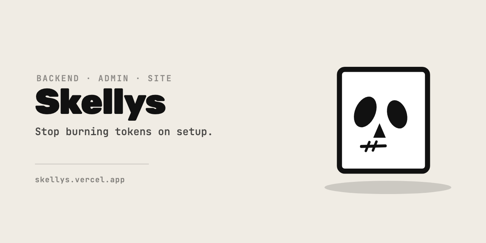

# Skellys

<div align="center">

[](./LICENSE)
[](./skills)
[](https://github.com/vercel-labs/skills)
[](https://skellys.vercel.app)

</div>

> Backend, admin and site skeletons your agent installs as a skill.

```bash
npx skills add yeahitsmejayyy/skellys
```

That installs all three. Your agent picks the right one when you ask for a backend, an admin
or a landing page — you never have to name the skill.

The installer auto-detects your agent. To be explicit, append a flag:

```bash
npx skills add yeahitsmejayyy/skellys -a claude-code
npx skills add yeahitsmejayyy/skellys -a cursor
npx skills add yeahitsmejayyy/skellys -a codex
npx skills add yeahitsmejayyy/skellys -a hermes-agent
```

---

## What You Get

| Skill | Starts | Stack |
|---|---|---|
| [`skelly-backend`](./skills/skelly-backend/SKILL.md) | an API with a database | Bun · SQLite · tRPC · Zod |
| [`skelly-admin`](./skills/skelly-admin/SKILL.md) | the portal you run your product from | React · Vite · Tailwind · shadcn/ui · tRPC |
| [`skelly-site`](./skills/skelly-site/SKILL.md) | a marketing site | React · Vite · Tailwind · shadcn/ui |

Ask for one in your own words — *"start me a backend for a notes app"* — and the skill clones
the template, renames it to your project, strips out everything that was about Skelly rather
than about you, proves it runs, and then builds your first real feature on it.

You end up holding a working feature, not an empty folder.

Renaming is done from a checked manifest, never a find-and-replace: package names and the
database filename are renamed, Skelly's own docs and licence are deleted, and the demo content
you are meant to hack on is left alone and reported to you so nothing Skelly-flavoured reaches
production by accident.

---

## They Compose

Cloned side by side in one product folder, they wire together:

```
acme-widgets/
├─ backend/     exports its router type
├─ admin/       typed against it, builds standalone
└─ site/        independent
```

`bun run sync:types` in the admin refreshes the contract when the backend's router changes.
Scaffold them under one project root and it just works. Each is also fine alone — take the one
you need.

---

## The Templates

| Repository | What it is |
|---|---|
| [skelly-backend](https://github.com/yeahitsmejayyy/skelly-backend) | A tiny, opinionated backend skeleton |
| [skelly-admin](https://github.com/yeahitsmejayyy/skelly-admin) | A clean, typed admin frontend |
| [skelly-site](https://github.com/yeahitsmejayyy/skelly-site) | A barebones marketing site |

---

## Contributing

Skills run with your agent's permissions, so read one before you install it — each is about a
hundred lines. Then:

```bash
./scripts/check.sh                    # install checks + manifest drift guard; seconds
node scripts/verify-manifest.mjs      # the manifests against the live templates
./scripts/e2e.sh backend              # one real agent run; spends usage
```

Adding a template is one `scaffold.json` beside a new `SKILL.md`, then the guard.

[ARCHITECTURE.md](./ARCHITECTURE.md) explains why the repository is shaped this way and what
each part of a `SKILL.md` is for. [SECURITY.md](./SECURITY.md) sets out exactly what these
skills instruct your agent to do.

---

## License

[MIT](./LICENSE)

Made with ♥ by [Jayyy](https://itsjayyy.com) · [skellys.vercel.app](https://skellys.vercel.app)
